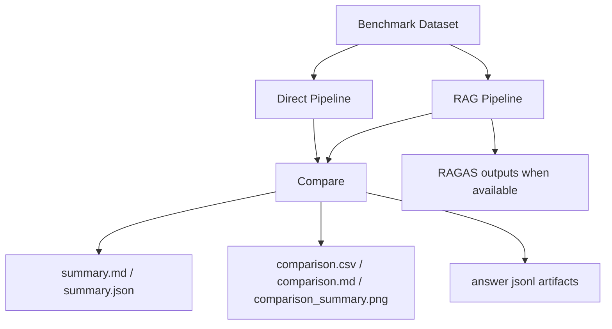

# LLM Eval Benchmark (CLI)

This repo provides a lightweight evaluation harness for comparing LLMs, prompts, and RAG vs direct answering. It is CLI-first and designed to run on HPC.

## Highlights
- promptfoo for prompt/system evals
- ragas for RAG-specific metrics
- structured reports for comparisons

## Official Release Entry

For external citation, portfolio use, and final benchmark conclusions, start here:

- `FINAL_RESULT_SUMMARY.md`
- `FINAL_RELEASE_GATE.md`
- `reports/README_RELEASE_STRUCTURE.md`
- `docs/benchmark_showcase.html` for a lightweight read-only presentation layer
- `reports/benchmark_final_summary_20260502/benchmark_results_final_summary_cn.md`
- `reports/benchmark_final_summary_20260502/benchmark_results_final_summary.md`

Important scoping:

- `reports/latest/*` is a local smoke / reproducibility output surface, not the promoted benchmark release.
- `data/fbtp_eval.jsonl` is a runnable 24-row smoke slice for end-to-end checks.
- `data/fbtp_eval_fixed_120.jsonl` is the official fixed-set dataset for promoted benchmark conclusions.

## Formal Benchmark Protocol (Current)

The current promoted benchmark release uses a controlled reasoning protocol for the main result family:

- Main table: `8 models x 2 methods (Direct / RAG)` on the fixed `120`-question set
- Stability release: selected-RAG clean comparison for `DeepSeek-V3.2` and `MiniMax-M2.7`, `100` rounds each, `RAG-only`
- Category table: same `8` controlled models, broken down by `ragppi / doc-design / schema_tables`
- Appendix table: same `8` models under provider-native mode
- `topK` ablation: same `8` models with candidate pool sweep `32 / 64 / 128`

Protocol note:

- `candidate_topk_256` is deprecated and is not part of the formal benchmark protocol
- formal reporting should only use `32 / 64 / 128`

Controlled reasoning policy:

- `DeepSeek-V3.2`: thinking disabled
- `GLM-5`: thinking disabled
- `Kimi-K2.5`: thinking disabled
- `DeepSeek-R1`: keep native reasoning behavior
- `Qwen3-235B-A22B-Instruct-2507`: controlled non-thinking protocol
- `MiniMax-M2`: controlled non-thinking protocol
- `MiniMax-M2.7`: controlled non-thinking protocol
- `ERNIE-4.5-Turbo-128K`: controlled non-thinking protocol

Supplementary appendix table:

- uses the same `8` models in provider-native mode
- Appendix runs are not mixed into the main or stability aggregates

Replacement note:

- `Baichuan-M3` was removed from the formal 8-model protocol on `2026-04-18` and replaced by `MiniMax-M2.7`
- this was due to provider-side `thinking` control incompatibility (`budget_tokens` errors), not a benchmark quality conclusion

Release-note clarification:

- Earlier larger stability plans and repair-heavy intermediate runs remain in the repo for auditability, but the promoted release surface is the clean summary package under `reports/benchmark_final_summary_20260502`.
- The dashboard / control-plane UI is an engineering support surface and is not the official release gate for benchmark conclusions.

See the Chinese benchmark protocol note:

- `docs/benchmark_protocol_cn.md`

## Architecture


## Quick Start
```bash
# promptfoo (node-based)
# npx promptfoo eval -c configs/promptfoo.yaml

# ragas (python-based)
# pip install -e ../llm-rag-knowledge-base
# python -m pipelines.rag_pipeline --data-path data/fbtp_eval.jsonl
```

## One-Click Eval
```bash
powershell -ExecutionPolicy Bypass -File scripts/run_eval.ps1
```

### Local Comparison Mode
When remote RAGAS evaluation is unavailable, `python -m pipelines.compare --eval-mode auto` falls back to a fully local metric set and still produces:
- `reports/latest/comparison.csv`
- `reports/latest/comparison.md`
- `reports/latest/comparison_summary.png`
- `reports/latest/summary.md`
- `reports/latest/summary.json`
- `reports/latest/rag_answers.jsonl`
- `reports/latest/direct_answers.jsonl`

If you want CI or automation to stop instead of silently downgrading, run:
```bash
python -m pipelines.compare --data-path data/fbtp_eval.jsonl --output-dir reports/latest --eval-mode auto --fail-on-fallback
```

That raises a hard error whenever the command would otherwise fall back from remote evaluation to local scoring.

## Repo Layout
- `data/`: benchmark datasets and small samples
- `prompts/`: prompt templates
- `pipelines/`: RAG vs direct pipelines
- `metrics/`: evaluation metrics
- `reports/`: generated results
- `finetune/`: optional LoRA/PEFT module

## Notes
- Do not commit full datasets. Keep scripts and small samples only.
- `data/fbtp_eval.jsonl` now ships with a 24-row runnable smoke slice so the repo can run end-to-end.
- Official benchmark conclusions should cite `data/fbtp_eval_fixed_120.jsonl` together with the promoted outputs under `reports/benchmark_final_summary_20260502`.
- When RAGAS is available, additional outputs are generated:
  - `reports/latest/ragas_scores.csv`
  - `reports/latest/ragas_scores.md`
  - `reports/latest/ragas_summary.md`
  - `reports/latest/ragas_summary.json`
  - `reports/latest/ragas_summary.png`

## RAG vs Direct (Comparison)
After running `python -m pipelines.compare`, check:
- `reports/latest/comparison.csv`
- `reports/latest/comparison.md`
- `reports/latest/comparison_summary.png`
- `reports/latest/category_breakdown.csv`
- `reports/latest/category_breakdown.md`

### Comparison Output (Sample)
| method | faithfulness | answer_relevancy | context_precision | latency_ms | estimated_cost_usd |
|---|---|---|---|---|---|
| RAG | 0.99 | 0.46 | 0.93 | 40.92 | 0.0044 |
| Direct |  | 0.60 |  | 6355.18 | 0.0007 |

### Category Breakdown
`category_breakdown.csv` now groups by `method + category`, so you can see whether a slice is strong because the method is good overall or because one specific category is easy.

## Multi-Model Repeated Sampling

`pipelines.compare` now supports a formal experiment matrix for repeated benchmark runs across multiple models.

Example:

```bash
python -m pipelines.compare \
  --data-path data/fbtp_eval_fixed_120.jsonl \
  --output-dir reports/formal_round1_4models \
  --eval-mode auto \
  --rounds 100 \
  --sample-size 100 \
  --with-replacement \
  --seed 42 \
  --benchmark-model DeepSeek-V3.2 \
  --benchmark-model GLM-5 \
  --benchmark-model Kimi-K2.5 \
  --benchmark-model DeepSeek-R1
```

You can also pass labeled model specs:

```bash
python -m pipelines.compare \
  --benchmark-model baseline=DeepSeek-V3.2 \
  --benchmark-model cn_structured=GLM-5 \
  --benchmark-model long_context=Kimi-K2.5 \
  --benchmark-model reasoner=DeepSeek-R1
```

Formal multi-model outputs include:

- `experiment_config.json`
- `per_round_results.csv`
- `model_summary.csv`
- `leaderboard.csv`
- `models/<slug>/summary.json`
- legacy compatibility files such as `comparison.csv`

See:

- `reports/benchmark_output_contract_2026-04-11.md`
## Evaluation Output (Sample)

### RAGAS Summary (Smoke Example, 24-row Checked-In Slice)
| metric | value |
|---|---|
| samples | 24 |
| eval_mode | ragas |
| RAG faithfulness | 0.9954 |
| RAG answer_relevancy | 0.4643 |
| RAG context_precision | 0.7083 |
| Direct answer_relevancy | 0.6213 |

This section is only a runnable smoke example. It is not the official promoted benchmark conclusion.

### File Outputs
- `reports/latest/ragas_scores.csv`
- `reports/latest/ragas_scores.md`
- `reports/latest/ragas_summary.md`
- `reports/latest/ragas_summary.json`
- `reports/latest/ragas_summary.png`
- `reports/latest/direct_ragas_scores.csv`
- `reports/latest/direct_ragas_scores.md`
- `reports/latest/direct_ragas_summary.md`
- `reports/latest/direct_ragas_summary.json`
- `reports/latest/direct_ragas_summary.png`
- `reports/latest/comparison.csv`
- `reports/latest/comparison.md`
- `reports/latest/comparison_summary.png`
- `reports/latest/category_breakdown.csv`
- `reports/latest/category_breakdown.md`
- `reports/latest/summary.md`
- `reports/latest/summary.json`

## Roadmap
- Add category-balanced evaluation slices beyond protein interaction rows.
- Persist automatic cleanup for stale RAGAS artifacts after local fallback runs.
- Split category breakdown by `method + category` instead of category-only aggregation.
- Add benchmark cards for structure-specific and methodology-specific domain questions.
