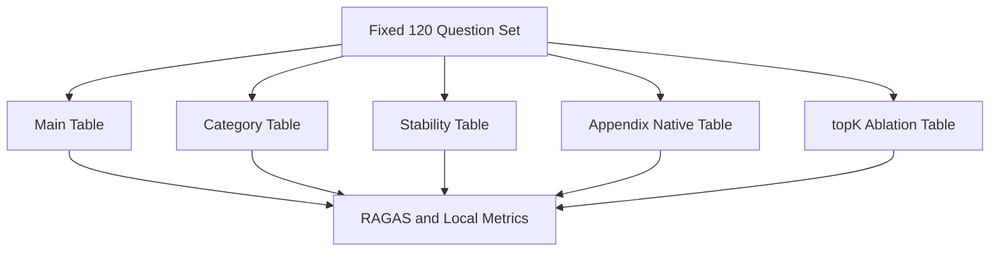

# Benchmark 正式测评报告（中文，历史快照 2026-04-19）

> 状态说明（2026-05-02 更新）：
> 本文档保留为 `2026-04-19` 的阶段性历史快照，用来记录主表阶段的分析与方法说明。
> 当前唯一正式交付入口已经切换为 `FINAL_RESULT_SUMMARY.md`、`FINAL_RELEASE_GATE.md` 和 `reports/benchmark_final_summary_20260502/`。
> 稳定性表、附加表和 `topK` 表的最终晋升结论请看新的正式汇总目录，本文不再代表最终 release 口径。

## 1. 报告定位

本报告面向论文写作、答辩汇报和 benchmark 复现实验，系统整理本项目当前 benchmark 工作的完整方法链条，包括模型选择、120 题固定评测集的构建原则、各类结果表的设计逻辑、评估指标体系、主结果表的当前结论，以及不纳入主结论的扩展分析表。报告只纳入目前已经完成并可验证的主结果表分析；稳定性表、附加表和 topK 消融表在本报告中只说明设计与方法，不作为主结果结论来源。

## 2. 研究目标与设计原则

本 benchmark 的目标不是做一个脱离上下文的“通用大模型排行榜”，而是在统一部署生态和统一 RAG 系统之下，测量 **RAG 相对于 Direct 的真实增益**。因此，整个测评体系优先保证内部效度而不是追求跨 provider 的最大覆盖。对主表、分类表和稳定性表，系统统一采用受控推理协议，尽量压低 provider 默认 thinking、隐藏 system prompt、接口差异、限流策略和超时行为对结论的污染。附加表与 topK 表被单独拆出，正是为了把“provider 原生行为差异”和“检索候选池大小差异”从主结论里剥离出来。

## 3. 模型选择依据

主表固定使用 8 个商业可稳定访问的中文商用大模型：DeepSeek-V3.2, GLM-5, Kimi-K2.5, DeepSeek-R1, Qwen3-235B-A22B-Instruct-2507, MiniMax-M2, MiniMax-M2.7, ERNIE-4.5-Turbo-128K。这一选择同时受三个条件约束。第一，模型必须能在同一套 OpenAI-compatible / 兼容 API 生态里稳定调用，避免把跨 provider 隐含提示词、不同 safety policy、不同 timeout 规则直接混进主比较。第二，模型需要能够支撑固定 120 题、多模型、后续 100 轮有放回抽样的真实 API 大规模测评成本。第三，模型在角色上要形成对照，包括强基线、中文问答组、长上下文组、推理增强组和补充组，从而让 `RAG vs Direct` 的比较更有解释力。

下表给出当前 8 模型在主表中的角色定义。

| model_label | model_role |
| --- | --- |
| MiniMax-M2.7 | MiniMax 系替补增强组，受控非 thinking |
| MiniMax-M2 | 商业模型补充组，受控非 thinking |
| DeepSeek-R1 | 推理增强组，保留原生 reasoning |
| GLM-5 | 中文和结构化问答对照组，受控非 thinking |
| Qwen3-235B-A22B-Instruct-2507 | 大模型补充组，受控非 thinking |
| Kimi-K2.5 | 长上下文整合对照组，受控非 thinking |
| ERNIE-4.5-Turbo-128K | 国产商用模型补充组，受控非 thinking |
| DeepSeek-V3.2 | 主基线，受控非 thinking |

在模型池之外，本研究明确没有把 GPT、Claude、Gemini 混入主表。这不是因为这些模型不重要，而是因为当前研究问题优先关注 **同一部署生态内 RAG 相对 Direct 的增益**。一旦直接跨 provider 比较，就会引入 reasoning-control 接口、隐藏提示、限流、拒答策略、上下文管理等额外混杂因素，从而削弱主结论的内部效度。这个限制将在论文中作为外部效度边界说明。

## 4. 120 题固定评测集是怎么选出来的

固定评测集由脚本 `pipelines.prepare_benchmark_dataset.py` 统一生成，不是人工零散拼题。生成器把评测题集拆成三部分：`ragppi_gold`、`doc_design` 和 `schema_tables`，再经过字段清洗、缺失过滤、去重和固定编号，得到最终 `fbtp_eval_fixed_120.jsonl`。代码层面的默认配比是 `40 / 20 / 60`，对应 `40` 条 interaction-centered 文本问答、`20` 条文档与设计方法学问答、`60` 条面向结构化数据库的 schema/table 问答。这个配比来自两个考虑：一是保留对 interaction-centered 检索链的充分压力测试；二是把已经实现的数据库设计、质量检查、执行链和 provenance 能力系统性纳入论文级题集，而不让 benchmark 只停留在一类问答上。

数据集的正式汇总如下。

| primary_bucket | record_type | benchmark_source_group | rows |
| --- | --- | --- | --- |
| schema_tables | jsonl | schema_tables | 60 |
| ragppi | csv | ragppi_gold | 40 |
| doc/design | text | doc_design | 20 |

从记录类型看，固定题集同时覆盖了 `csv`、`text` 和 `jsonl` 三类信息源；从来源组看，固定题集分别对应 interaction 文本证据、方法学/设计文档证据、以及数据库规范化表结构证据。这保证 benchmark 不只是测“长文本摘要能力”，而是在同一框架下同时测检索、跨表、结构化字段命中、方法学理解和证据对齐。

## 5. 为什么说这 120 题具有科学依据

这 120 题的构建遵循了“固定全集 + 分层覆盖 + 可复核 ground truth”的原则。第一，每题都保留明确 `ground_truth`、期望答案片段、期望来源、期望表族或期望主键等约束，使得后续评估既可以使用 RAGAS，也可以使用本地结构化命中指标。第二，题集结构是分层而不是随机混合：`ragppi` 负责检验 interaction-centered 检索与摘要，`doc/design` 负责检验系统设计理解和方法学复述，`schema_tables` 负责检验多表结构、ID 与字段级命中能力。第三，固定全集保证主结果表可重复，后续稳定性表再在同一全集上做有放回抽样，从而把“可复现的主结论”和“统计上的波动性评估”分开。

更细一层的二级题型分布如下。

| primary_bucket | secondary_bucket | rows |
| --- | --- | --- |
| doc/design | architecture | 5 |
| doc/design | benchmark_protocol | 5 |
| doc/design | database | 5 |
| doc/design | quality | 5 |
| ragppi | protein_interaction | 40 |
| schema_tables | affinity | 8 |
| schema_tables | interaction_overview | 8 |
| schema_tables | protein_profile | 8 |
| schema_tables | developability | 6 |
| schema_tables | annotation | 4 |
| schema_tables | protein_identifier | 4 |
| schema_tables | provenance | 4 |
| schema_tables | structure | 4 |
| schema_tables | digestive_assay | 2 |
| schema_tables | immunogenicity | 2 |
| schema_tables | loop_annotation | 2 |
| schema_tables | loop_flexibility | 2 |
| schema_tables | protein_flexibility | 2 |
| schema_tables | source_metadata | 2 |
| schema_tables | target_variant | 2 |

这些二级题型覆盖了 protein profile、protein identifier、interaction overview、affinity、developability、annotation、provenance、structure、digestive assay、immunogenicity、loop annotation、loop flexibility、protein flexibility、target variant、source metadata，以及 architecture、quality、database、benchmark protocol 等文档设计问题。换句话说，这个固定集并不是通用百科题，而是围绕你自己的数据库设计、RAG 执行链和知识对象来设计的“任务型题集”。

## 6. 题目都是什么样

下面先给出三大类题目的代表性样例。

| primary_bucket | question_id | secondary_bucket | question |
| --- | --- | --- | --- |
| ragppi | fixed-001 | protein_interaction | What is reported about the interaction between KLK7 and CDSN? Summarize the biological significance concisely. |
| ragppi | fixed-002 | protein_interaction | What is reported about the interaction between MED15 and sbp-1? Summarize the biological significance concisely. |
| ragppi | fixed-003 | protein_interaction | What is reported about the interaction between CET1 and CEG1? Summarize the biological significance concisely. |
| ragppi | fixed-004 | protein_interaction | What is reported about the interaction between Blos1 and Rab11? Summarize the biological significance concisely. |
| ragppi | fixed-005 | protein_interaction | What is reported about the interaction between rev and DDX21? Summarize the biological significance concisely. |
| doc/design | fixed-041 | architecture | What unified execution chain does the benchmark-ready RAG system use? |
| doc/design | fixed-042 | architecture | Which three query families are explicitly distinguished by the routing layer? |
| doc/design | fixed-043 | architecture | What retrieval stack is used to balance semantic similarity with exact entity mentions? |
| doc/design | fixed-044 | architecture | When is prompt compression activated in the benchmark-ready RAG system? |
| doc/design | fixed-045 | architecture | How should the answer layer present an entity like PROT-00007 when a readable display name exists? |
| schema_tables | fixed-061 | protein_profile | Give a concise profile for protein PROT-00788. Include canonical name, organism, and scaffold/domain information. |
| schema_tables | fixed-062 | protein_profile | Give a concise profile for protein PROT-01479. Include canonical name, organism, and scaffold/domain information. |
| schema_tables | fixed-063 | protein_profile | Give a concise profile for protein PROT-02056. Include canonical name, organism, and scaffold/domain information. |
| schema_tables | fixed-064 | protein_profile | Give a concise profile for protein PROT-01986. Include canonical name, organism, and scaffold/domain information. |
| schema_tables | fixed-065 | protein_profile | Give a concise profile for protein PROT-01723. Include canonical name, organism, and scaffold/domain information. |

为了方便论文写作和人工审阅，完整 120 题目录已经同步输出到：

- `reports/remote_sync/main_results_ragas_fixed120_controlled8_merged_20260418_133150/local_analysis/question_catalog.csv`
- `reports/remote_sync/main_results_ragas_fixed120_controlled8_merged_20260418_133150/local_analysis/question_catalog.md`

本报告末尾也附上完整题目清单。

## 7. 主表、分类表、稳定性表、附加表、topK 表分别是什么

整个 benchmark 不是一张表，而是一套职责明确的结果矩阵。其设计如下。

| table_name | scope | configuration | why | status |
| --- | --- | --- | --- | --- |
| 主结果表 | 8 模型 × Direct / RAG × 固定 120 题 | rounds=1, sample_size=120, with_replacement=false, seed=42, eval_mode=ragas, top_k=5 | 作为论文主结论，直接回答 RAG 相对 Direct 的真实增益。 | 已完成并纳入本报告 |
| 分类结果表 | 8 模型 × ragppi / doc/design / schema_tables | 与主表同协议，按题型拆分统计 | 分析 RAG 在不同问题结构上的优势与短板。 | 设计已锁定，本报告仅引用主表内可直接重建的分类分析 |
| 稳定性表 | 4 模型 × 100 轮 × 每轮 50 题有放回抽样 | 均值、标准差、P50、P95、95% CI、RAG-Direct uplift | 衡量真实 API 条件下的波动性、超时风险与增益稳定性。 | 结果未在本报告中纳入 |
| 附加表 | 8 模型 provider-native / native-thinking | 与主表同题集，但不压制 provider-native 行为 | 分离主表受控协议与原生 provider 行为之间的差异。 | 结果未在本报告中纳入 |
| topK 消融表 | 8 模型 × topK [32, 64, 128] | 只改候选池 candidate_top_k，最终上下文 top_k 固定为 5 | 验证候选池增大是否值得延迟和成本代价。 | 结果未在本报告中纳入 |

对应的结构关系可以概括为：

主表回答“RAG 是否比 Direct 更好”；分类表回答“在哪类问题上更好”；稳定性表回答“这种提升是否稳定”；附加表回答“如果放开 provider-native 行为，结论会怎样变化”；topK 表回答“候选池加大是否值得”。因此，这几张表互相补充，但不互相替代。

## 8. 主表配置为什么这样定

本轮已经完成的主表采用的是固定全集一次性全量跑完的配置，而不是抽样：`population_size=120`、`rounds=1`、`sample_size=120`、`with_replacement=false`、`seed=42`。这意味着主表是“固定全集的 A/B 对比”，用来提供最清晰、最容易解释的论文主结论。检索侧在主表中固定最终上下文 `top_k=5`，而检索候选池大小的敏感性问题则被显式留给单独的 topK 消融表，不在主表混跑。主表使用 `eval_mode=ragas`，保证回答相关性、faithfulness 和 context precision 都在同一框架下评估。

## 9. 推理协议为什么要受控

主表、分类表和稳定性表统一使用受控推理协议，原因在于不同模型对 thinking 的默认策略并不一致。如果不做控制，Direct 与 RAG 之间的差异很可能混入模型自身推理模式变化，而不是系统带来的真实增益。本项目当前受控协议是：`DeepSeek-V3.2`、`GLM-5`、`Kimi-K2.5`、`Qwen3-235B-A22B-Instruct-2507`、`MiniMax-M2`、`MiniMax-M2.7`、`ERNIE-4.5-Turbo-128K` 都走受控非 thinking 协议；只有 `DeepSeek-R1` 保留原生 reasoning，因为强行关闭在兼容接口下可能导致可见答案异常。这样做的核心目的，是让 Direct 与 RAG 在同一模型上共享完全一致的回答协议，从而把比较焦点放回 RAG 系统本身。

## 10. 结果是怎么评估的

本 benchmark 采用 “RAGAS 主指标 + 本地结构化指标 + 运行时指标” 的三层评估框架。RAGAS 负责判断回答是否相关、是否忠于证据、上下文是否有效；本地结构化指标负责判断回答是否命中目标来源、表族和实体 ID；运行时指标负责衡量时延、成功率和失败率。这种组合比单一分数更适合你的系统，因为它既覆盖生成质量，也覆盖数据库问答链条最核心的检索与字段对齐能力。

| metric | source | meaning |
| --- | --- | --- |
| answer_relevancy | RAGAS | 回答是否真正回答了问题，是主结果表首要指标。 |
| faithfulness | RAGAS | 回答是否忠于检索证据，用于抑制幻觉。 |
| context_precision | RAGAS | 送入回答链的上下文是否相关，反映检索和重排质量。 |
| source_hit_rate | 本地结构化指标 | 回答是否命中期望来源。 |
| table_hit_rate | 本地结构化指标 | 回答是否命中目标表族，反映跨表检索对齐。 |
| id_hit_rate | 本地结构化指标 | 回答是否命中目标实体 ID。 |
| latency_ms | 运行时指标 | 单题链路时延，用于分析质量与效率折中。 |
| failed_rows / success_rows | 运行时指标 | 失败题和成功题数量，用于稳定性与工程可用性评估。 |

## 11. 当前主表已经完成到什么程度

本轮已完成主表合并目录为 `reports/remote_sync/main_results_ragas_fixed120_controlled8_merged_20260418_133150`。该目录包含总表 `comparison.csv`、`model_summary.csv`、每个模型的 `round_001` 原始回答、RAGAS 输出和分模型汇总，因此主结果已经具备复查和复算条件。当前主表共覆盖 `8` 个模型，且 `8` 个模型的 `RAG answer_relevancy` 都已可直接比较。

## 12. 主表核心结果

下表是当前主表的核心摘要。`uplift = rag_answer_relevancy - direct_answer_relevancy`。

| model_label | direct_answer_relevancy | rag_answer_relevancy | uplift | direct_latency_ms | rag_latency_ms | latency_ratio_rag_vs_direct | rag_faithfulness | rag_context_precision |
| --- | --- | --- | --- | --- | --- | --- | --- | --- |
| MiniMax-M2.7 | 0.0056 | 0.9072 | 0.9016 | 4856.8974 | 145266.9492 | 29.9094 | 0.7905 | 1.0000 |
| MiniMax-M2 | 0.0139 | 0.7701 | 0.7562 | 2571.4031 | 255238.6721 | 99.2605 | 0.8230 | 1.0000 |
| DeepSeek-R1 | 0.0682 | 0.7326 | 0.6644 | 7422.6157 | 27262.9186 | 3.6730 | 0.8540 | 0.9235 |
| GLM-5 | 0.1391 | 0.7772 | 0.6381 | 4027.7729 | 15726.5282 | 3.9045 | 0.8755 | 0.9302 |
| Qwen3-235B-A22B-Instruct-2507 | 0.1795 | 0.7388 | 0.5593 | 1986.2049 | 181054.5743 | 91.1560 | 0.8455 | 1.0000 |
| Kimi-K2.5 | 0.1649 | 0.6350 | 0.4701 | 2153.1919 | 15151.6164 | 7.0368 | 0.8552 | 0.9382 |
| ERNIE-4.5-Turbo-128K | 0.4061 | 0.7309 | 0.3248 | 2754.0511 | 84580.6646 | 30.7114 | 0.8114 | 1.0000 |
| DeepSeek-V3.2 | 0.6398 | 0.7660 | 0.1262 | 2779.8517 | 15600.5752 | 5.6120 | 0.8439 | 0.9263 |

从当前已完成的主表可以直接得到三个结论。第一，`8` 个可比较模型全部呈现 `RAG > Direct` 的 answer relevancy，说明你的 RAG 系统在受控协议下具有稳定的正增益。第二，增益最大的模型是 `MiniMax-M2.7`，其 uplift 为 `0.9016`；增益最小但仍为正的模型是 `DeepSeek-V3.2`，其 uplift 为 `0.1262`。第三，质量提升并不是免费的：`RAG` 的平均时延显著高于 `Direct`，其中最慢的 RAG 模型是 `MiniMax-M2`，平均时延达到 `255238.67` ms，而 `Direct` 最快的模型是 `Qwen3-235B-A22B-Instruct-2507`，平均时延仅 `1986.20` ms。

如果从证据一致性的角度看，当前主表里 faithfulness 最高的模型是 `GLM-5`，其 `rag_faithfulness` 为 `0.8755`。这说明本轮主表不是靠“模型更会编”获得高分，而是伴随着较高的证据忠实度和上下文精度。

## 13. 主表结果应该怎么解读

主表中最值得强调的模式是，RAG 对弱 Direct 基线模型的提升尤其明显。像 `MiniMax-M2.7`、`DeepSeek-R1`、`GLM-5` 这类模型，Direct 基线较弱或较保守时，RAG 能显著把回答拉回到与题目和证据更一致的状态。与此同时，像 `DeepSeek-V3.2` 这类 Direct 基线已经相对较强的模型，RAG 仍能继续提供增益，只是 uplift 不会像弱基线模型那样夸张。这种现象对论文写作很有价值，因为它说明 RAG 的价值不是只存在于“弱模型补课”，也能在强基线上继续发挥作用。

另一方面，主表也清楚展示了“质量—时延折中”是真实存在的。部分模型虽然获得了很高 uplift，但 `RAG` 时延成倍增加，甚至出现几十倍以上的时延倍率。因此在论文中，主结论应该写成“RAG 在相关性和证据一致性上显著优于 Direct，但这种增益伴随明显的时延代价”，而不是简单地把 RAG 说成无条件更优。

## 14. 按题型看，RAG 的优势集中在哪里

利用主表内各模型的题型级拆分结果，可以把 `ragppi`、`doc/design` 和 `schema_tables` 三类问题分别比较。当前按模型平均后的 uplift 如下。

| category | answer_relevancy_uplift_mean |
| --- | --- |
| doc/design | 0.6719 |
| schema_tables | 0.6062 |
| ragppi | 0.4203 |

这个结果表明，当前 RAG 系统对 `doc/design` 和 `schema_tables` 两类问题的帮助最大，对 `ragppi` 的帮助相对较小。这种差异是合理的。`doc/design` 问题的答案往往可以从较明确的文档证据中抽取和复述，`schema_tables` 问题又天然依赖 ID、表族和字段对齐，因此 RAG 对这两类任务能直接发挥检索与结构化证据优势。相比之下，`ragppi` 问题更接近 interaction-centered 的关系摘要，往往需要对长文本证据做更强的压缩与概括，因此提升空间更依赖生成模型本身的摘要稳定性。

## 15. MiniMax-M2 缺失列问题已经如何补回

这一轮里最典型的缺列问题曾经发生在 `MiniMax-M2`：主表文件没有丢，原始回答也没有丢，真正缺失的是原始 RAGAS 产物里的 `RAG answer_relevancy`。后来我没有改 judge、没有改 strictness，也没有把它换成别的模型，而是用 **同样的 `MiniMax-M2` judge 和同样的 `strictness=3`** 对现成 `rag_answers.jsonl` 做了单模型补评，并把结果回填进 `ragas_scores.csv`、`ragas_summary.json`、模型级 `model_summary.csv` 和主表总汇总。因此现在的 `MiniMax-M2` 分数已经回到与其他模型同一套标准下，不属于换标准补分。

| scope | model_label | category | issue |
| --- | --- | --- | --- |
| category | MiniMax-M2.7 | doc/design | RAG answer_relevancy 缺失，已在兼容透视表中保留 answer_relevancy_rag 列并以空值标记。 |

这意味着报告脚本已经不会再因为缺列或补评后的列更新而失真。这个边界在论文中也应该保持诚实：如果存在缺值就明确标注，如果缺值已经在同标准下补回，也要把补回方法写清楚。

## 16. 原始回答与运行时完整性

为了验证主表不是只剩汇总分数，我还把每个模型的 `rag_answers.jsonl` 和 `direct_answers.jsonl` 做了盘点。结果如下。

| model_label | method | rows | status_ok_rows | status_error_rows | avg_answer_chars | avg_latency_ms_from_jsonl | path |
| --- | --- | --- | --- | --- | --- | --- | --- |
| deepseek-r1 | Direct | 120 | 120 | 0 | 8.0700 | 7422.6157 | <local_path_removed>|
| deepseek-r1 | RAG | 120 | 120 | 0 | 475.1300 | 27262.9186 | <local_path_removed>|
| deepseek-v3-2 | Direct | 120 | 120 | 0 | 99.6000 | 2779.8517 | <local_path_removed>|
| deepseek-v3-2 | RAG | 120 | 120 | 0 | 296.7700 | 15600.5752 | <local_path_removed>|
| ernie-4-5-turbo-128k | Direct | 120 | 120 | 0 | 60.3700 | 2754.0511 | <local_path_removed>|
| ernie-4-5-turbo-128k | RAG | 120 | 120 | 0 | 280.8600 | 84580.6646 | <local_path_removed>|
| glm-5 | Direct | 120 | 120 | 0 | 53.2700 | 4027.7729 | <local_path_removed>|
| glm-5 | RAG | 120 | 120 | 0 | 355.3500 | 15726.5282 | <local_path_removed>|
| kimi-k2-5 | Direct | 120 | 120 | 0 | 60.3900 | 2153.1919 | <local_path_removed>|
| kimi-k2-5 | RAG | 120 | 120 | 0 | 412.5000 | 15151.6164 | <local_path_removed>|
| minimax-m2 | Direct | 120 | 120 | 0 | 7.4800 | 2571.4031 | <local_path_removed>|
| minimax-m2 | RAG | 120 | 119 | 1 | 482.9800 | 255238.6721 | <local_path_removed>|
| minimax-m2-7 | Direct | 120 | 120 | 0 | 18.4400 | 4856.8974 | <local_path_removed>|
| minimax-m2-7 | RAG | 120 | 120 | 0 | 644.7700 | 145266.9492 | <local_path_removed>|
| qwen3-235b-a22b-instruct-2507 | Direct | 120 | 120 | 0 | 62.7400 | 1986.2049 | <local_path_removed>|
| qwen3-235b-a22b-instruct-2507 | RAG | 120 | 120 | 0 | 372.7500 | 181054.5743 | <local_path_removed>|

这张表说明，当前大部分模型的 `RAG` 与 `Direct` 都能做到 `120/120` 成功完成；`MiniMax-M2` 则有 `1` 条 RAG 失败记录。工程上，这些原始回答文件使得后续人工 spot check、错误归因和论文附录复核都具备条件。

## 17. 为什么稳定性表、附加表和 topK 表现在先不纳入结果分析

这三类表的职责与主表不同。稳定性表本质上是重复抽样统计，不适合替代主表结论；附加表故意放开 provider-native 行为，其作用是解释“原生模式是否改变结论”，不应该替代主表；topK 表则只回答“检索候选池是否值得变大”，也不应拿来替代主表排序。当前正式协议仅保留 `32 / 64 / 128` 三档候选池，`256` 因真实 API 成本和时延开销过高而不再纳入正式结果解释。因此本报告只保留三档设计说明，不把扩展表作为主结论来源。

## 18. 当前主表的结论边界

当前已经可以成立的结论是：在统一部署生态、统一受控协议、固定 120 题全集上，你的 RAG 系统相对于 Direct 基线在大多数模型上都有明确正增益，且这种增益在 `doc/design` 与 `schema_tables` 两类问题上尤其明显。同时，RAG 的收益伴随着真实可见的时延代价，因此后续稳定性表与 topK 表对于“增益是否稳定、代价是否可接受”仍然是必须的补充，而不是可有可无的附属实验。

## 19. 本报告对应的关键文件

本报告依赖并生成的关键文件包括：

- 主表目录：`reports/remote_sync/main_results_ragas_fixed120_controlled8_merged_20260418_133150`
- 主表总汇总：`reports/remote_sync/main_results_ragas_fixed120_controlled8_merged_20260418_133150/model_summary.csv`
- 主表原始回答：`reports/remote_sync/main_results_ragas_fixed120_controlled8_merged_20260418_133150/models/*/round_001/*_answers.jsonl`
- 本地分析目录：`reports/remote_sync/main_results_ragas_fixed120_controlled8_merged_20260418_133150/local_analysis`
- 题集：`data/fbtp_eval_fixed_120.jsonl`
- 题集汇总：`data/fbtp_eval_fixed_120.summary.json`

## 20. 附录：固定 120 题完整目录

| question_id | primary_bucket | secondary_bucket | record_type | benchmark_source_group | question |
| --- | --- | --- | --- | --- | --- |
| fixed-001 | ragppi | protein_interaction | csv | ragppi_gold | What is reported about the interaction between KLK7 and CDSN? Summarize the biological significance concisely. |
| fixed-002 | ragppi | protein_interaction | csv | ragppi_gold | What is reported about the interaction between MED15 and sbp-1? Summarize the biological significance concisely. |
| fixed-003 | ragppi | protein_interaction | csv | ragppi_gold | What is reported about the interaction between CET1 and CEG1? Summarize the biological significance concisely. |
| fixed-004 | ragppi | protein_interaction | csv | ragppi_gold | What is reported about the interaction between Blos1 and Rab11? Summarize the biological significance concisely. |
| fixed-005 | ragppi | protein_interaction | csv | ragppi_gold | What is reported about the interaction between rev and DDX21? Summarize the biological significance concisely. |
| fixed-006 | ragppi | protein_interaction | csv | ragppi_gold | What is reported about the interaction between ASF1 and BDF1? Summarize the biological significance concisely. |
| fixed-007 | ragppi | protein_interaction | csv | ragppi_gold | What is reported about the interaction between tan and Asx? Summarize the biological significance concisely. |
| fixed-008 | ragppi | protein_interaction | csv | ragppi_gold | What is reported about the interaction between ABCC8 and KCNJ11? Summarize the biological significance concisely. |
| fixed-009 | ragppi | protein_interaction | csv | ragppi_gold | What is reported about the interaction between wip-1 and wsp-1? Summarize the biological significance concisely. |
| fixed-010 | ragppi | protein_interaction | csv | ragppi_gold | What is reported about the interaction between MSS116 and RPO41? Summarize the biological significance concisely. |
| fixed-011 | ragppi | protein_interaction | csv | ragppi_gold | What is reported about the interaction between ytr and Tsp68C? Summarize the biological significance concisely. |
| fixed-012 | ragppi | protein_interaction | csv | ragppi_gold | What is reported about the interaction between SPC110 and CMD1? Summarize the biological significance concisely. |
| fixed-013 | ragppi | protein_interaction | csv | ragppi_gold | What is reported about the interaction between MDN1 and WDR12? Summarize the biological significance concisely. |
| fixed-014 | ragppi | protein_interaction | csv | ragppi_gold | What is reported about the interaction between env and CD4? Summarize the biological significance concisely. |
| fixed-015 | ragppi | protein_interaction | csv | ragppi_gold | What is reported about the interaction between HAP5 and HAP2? Summarize the biological significance concisely. |
| fixed-016 | ragppi | protein_interaction | csv | ragppi_gold | What is reported about the interaction between Pc and Pcl? Summarize the biological significance concisely. |
| fixed-017 | ragppi | protein_interaction | csv | ragppi_gold | What is reported about the interaction between LDHA and SQSTM1? Summarize the biological significance concisely. |
| fixed-018 | ragppi | protein_interaction | csv | ragppi_gold | What is reported about the interaction between CD81 and CBL? Summarize the biological significance concisely. |
| fixed-019 | ragppi | protein_interaction | csv | ragppi_gold | What is reported about the interaction between WASp and Cip4? Summarize the biological significance concisely. |
| fixed-020 | ragppi | protein_interaction | csv | ragppi_gold | What is reported about the interaction between nsp12 and nsp8? Summarize the biological significance concisely. |
| fixed-021 | ragppi | protein_interaction | csv | ragppi_gold | What is reported about the interaction between tsp-15 and bli-3? Summarize the biological significance concisely. |
| fixed-022 | ragppi | protein_interaction | csv | ragppi_gold | What is reported about the interaction between ABI3 and ABI5? Summarize the biological significance concisely. |
| fixed-023 | ragppi | protein_interaction | csv | ragppi_gold | What is reported about the interaction between INO80 and FANCM? Summarize the biological significance concisely. |
| fixed-024 | ragppi | protein_interaction | csv | ragppi_gold | What is reported about the interaction between AHP1 and ARR4? Summarize the biological significance concisely. |
| fixed-025 | ragppi | protein_interaction | csv | ragppi_gold | What is reported about the interaction between Dis3 and Rrp6? Summarize the biological significance concisely. |
| fixed-026 | ragppi | protein_interaction | csv | ragppi_gold | What is reported about the interaction between FBXW7 and FAM83D? Summarize the biological significance concisely. |
| fixed-027 | ragppi | protein_interaction | csv | ragppi_gold | What is reported about the interaction between OKP1 and AME1? Summarize the biological significance concisely. |
| fixed-028 | ragppi | protein_interaction | csv | ragppi_gold | What is reported about the interaction between AXL and S? Summarize the biological significance concisely. |
| fixed-029 | ragppi | protein_interaction | csv | ragppi_gold | What is reported about the interaction between cac and comt? Summarize the biological significance concisely. |
| fixed-030 | ragppi | protein_interaction | csv | ragppi_gold | What is reported about the interaction between cyb-3 and cdk-1? Summarize the biological significance concisely. |
| fixed-031 | ragppi | protein_interaction | csv | ragppi_gold | What is reported about the interaction between USP8 and CHMP1A? Summarize the biological significance concisely. |
| fixed-032 | ragppi | protein_interaction | csv | ragppi_gold | What is reported about the interaction between IFRD1 and MEF2C? Summarize the biological significance concisely. |
| fixed-033 | ragppi | protein_interaction | csv | ragppi_gold | What is reported about the interaction between tsc2 and tsc1? Summarize the biological significance concisely. |
| fixed-034 | ragppi | protein_interaction | csv | ragppi_gold | What is reported about the interaction between STAM and USP8? Summarize the biological significance concisely. |
| fixed-035 | ragppi | protein_interaction | csv | ragppi_gold | What is reported about the interaction between SAS3 and GCN5? Summarize the biological significance concisely. |
| fixed-036 | ragppi | protein_interaction | csv | ragppi_gold | What is reported about the interaction between LINC00941 and ANXA2? Summarize the biological significance concisely. |
| fixed-037 | ragppi | protein_interaction | csv | ragppi_gold | What is reported about the interaction between UBTD2 and USP5? Summarize the biological significance concisely. |
| fixed-038 | ragppi | protein_interaction | csv | ragppi_gold | What is reported about the interaction between cup and EndoA? Summarize the biological significance concisely. |
| fixed-039 | ragppi | protein_interaction | csv | ragppi_gold | What is reported about the interaction between Cep97 and Sirt2? Summarize the biological significance concisely. |
| fixed-040 | ragppi | protein_interaction | csv | ragppi_gold | What is reported about the interaction between ASGR1 and S? Summarize the biological significance concisely. |
| fixed-041 | doc/design | architecture | text | doc_design | What unified execution chain does the benchmark-ready RAG system use? |
| fixed-042 | doc/design | architecture | text | doc_design | Which three query families are explicitly distinguished by the routing layer? |
| fixed-043 | doc/design | architecture | text | doc_design | What retrieval stack is used to balance semantic similarity with exact entity mentions? |
| fixed-044 | doc/design | architecture | text | doc_design | When is prompt compression activated in the benchmark-ready RAG system? |
| fixed-045 | doc/design | architecture | text | doc_design | How should the answer layer present an entity like PROT-00007 when a readable display name exists? |
| fixed-046 | doc/design | quality | text | doc_design | Which quality check protects exact document terminology and fixed document answers? |
| fixed-047 | doc/design | quality | text | doc_design | What does citation_field_correctness prevent in citation-oriented answers? |
| fixed-048 | doc/design | quality | text | doc_design | What does cross_table_join_consistency verify in the quality layer? |
| fixed-049 | doc/design | quality | text | doc_design | How are quality failures and runtime degradations surfaced by the system? |
| fixed-050 | doc/design | quality | text | doc_design | Is the current monitoring layer an official Deepchecks SDK integration or a local Deepchecks-style implementation? |
| fixed-051 | doc/design | database | text | doc_design | Which three normalized tables form the core entity path for proteins, domains, and interactions? |
| fixed-052 | doc/design | database | text | doc_design | Which tables capture target context in the normalized database design? |
| fixed-053 | doc/design | database | text | doc_design | Which tables are used to represent structural flexibility at loop and protein levels? |
| fixed-054 | doc/design | database | text | doc_design | Which table families support developability, oral-uptake, and digestive-stability questions? |
| fixed-055 | doc/design | database | text | doc_design | Which tables provide provenance and review lineage for source-oriented questions? |
| fixed-056 | doc/design | benchmark_protocol | text | doc_design | What is the fixed-set composition used in benchmark phase 1? |
| fixed-057 | doc/design | benchmark_protocol | text | doc_design | What is the primary evaluation framework in benchmark phase 1? |
| fixed-058 | doc/design | benchmark_protocol | text | doc_design | What is the core A/B comparison defined for benchmark phase 1? |
| fixed-059 | doc/design | benchmark_protocol | text | doc_design | What role does Deepchecks-style monitoring play in phase 1 benchmarking? |
| fixed-060 | doc/design | benchmark_protocol | text | doc_design | Where are Kotaemon-style reasoning and GPT-RAG-style prompt compression positioned in the benchmark narrative? |
| fixed-061 | schema_tables | protein_profile | jsonl | schema_tables | Give a concise profile for protein PROT-00788. Include canonical name, organism, and scaffold/domain information. |
| fixed-062 | schema_tables | protein_profile | jsonl | schema_tables | Give a concise profile for protein PROT-01479. Include canonical name, organism, and scaffold/domain information. |
| fixed-063 | schema_tables | protein_profile | jsonl | schema_tables | Give a concise profile for protein PROT-02056. Include canonical name, organism, and scaffold/domain information. |
| fixed-064 | schema_tables | protein_profile | jsonl | schema_tables | Give a concise profile for protein PROT-01986. Include canonical name, organism, and scaffold/domain information. |
| fixed-065 | schema_tables | protein_profile | jsonl | schema_tables | Give a concise profile for protein PROT-01723. Include canonical name, organism, and scaffold/domain information. |
| fixed-066 | schema_tables | protein_profile | jsonl | schema_tables | Give a concise profile for protein PROT-00443. Include canonical name, organism, and scaffold/domain information. |
| fixed-067 | schema_tables | protein_profile | jsonl | schema_tables | Give a concise profile for protein PROT-01880. Include canonical name, organism, and scaffold/domain information. |
| fixed-068 | schema_tables | protein_profile | jsonl | schema_tables | Give a concise profile for protein PROT-02039. Include canonical name, organism, and scaffold/domain information. |
| fixed-069 | schema_tables | protein_identifier | jsonl | schema_tables | What UniProt identifier is recorded for protein PROT-01677? |
| fixed-070 | schema_tables | protein_identifier | jsonl | schema_tables | What PDB identifier is recorded for protein PROT-01563? |
| fixed-071 | schema_tables | protein_identifier | jsonl | schema_tables | What UniProt_Entry identifier is recorded for protein PROT-00649? |
| fixed-072 | schema_tables | protein_identifier | jsonl | schema_tables | What UniProt_Entry identifier is recorded for protein PROT-01397? |
| fixed-073 | schema_tables | interaction_overview | jsonl | schema_tables | For interaction INT-00667, which protein/domain is involved and is it inhibitory? |
| fixed-074 | schema_tables | interaction_overview | jsonl | schema_tables | For interaction INT-00681, which protein/domain is involved and is it inhibitory? |
| fixed-075 | schema_tables | interaction_overview | jsonl | schema_tables | For interaction INT-01258, which protein/domain is involved and is it inhibitory? |
| fixed-076 | schema_tables | interaction_overview | jsonl | schema_tables | For interaction INT-01224, which protein/domain is involved and is it inhibitory? |
| fixed-077 | schema_tables | interaction_overview | jsonl | schema_tables | For interaction INT-01818, which protein/domain is involved and is it inhibitory? |
| fixed-078 | schema_tables | interaction_overview | jsonl | schema_tables | For interaction INT-00732, which protein/domain is involved and is it inhibitory? |
| fixed-079 | schema_tables | interaction_overview | jsonl | schema_tables | For interaction INT-00316, which protein/domain is involved and is it inhibitory? |
| fixed-080 | schema_tables | interaction_overview | jsonl | schema_tables | For interaction INT-00653, which protein/domain is involved and is it inhibitory? |
| fixed-081 | schema_tables | affinity | jsonl | schema_tables | What affinity is recorded for interaction INT-01454 and how was it determined? |
| fixed-082 | schema_tables | affinity | jsonl | schema_tables | What affinity is recorded for interaction INT-00030 and how was it determined? |
| fixed-083 | schema_tables | affinity | jsonl | schema_tables | What affinity is recorded for interaction INT-00148 and how was it determined? |
| fixed-084 | schema_tables | affinity | jsonl | schema_tables | What affinity is recorded for interaction INT-01745 and how was it determined? |
| fixed-085 | schema_tables | affinity | jsonl | schema_tables | What affinity is recorded for interaction INT-00993 and how was it determined? |
| fixed-086 | schema_tables | affinity | jsonl | schema_tables | What affinity is recorded for interaction INT-01943 and how was it determined? |
| fixed-087 | schema_tables | affinity | jsonl | schema_tables | What affinity is recorded for interaction INT-00370 and how was it determined? |
| fixed-088 | schema_tables | affinity | jsonl | schema_tables | What affinity is recorded for interaction INT-01788 and how was it determined? |
| fixed-089 | schema_tables | developability | jsonl | schema_tables | What developability or CMC signal is recorded for protein PROT-00825? |
| fixed-090 | schema_tables | developability | jsonl | schema_tables | What developability or CMC signal is recorded for protein PROT-02417? |
| fixed-091 | schema_tables | developability | jsonl | schema_tables | What developability or CMC signal is recorded for protein PROT-02530? |
| fixed-092 | schema_tables | developability | jsonl | schema_tables | What developability or CMC signal is recorded for protein PROT-01015? |
| fixed-093 | schema_tables | developability | jsonl | schema_tables | What developability or CMC signal is recorded for protein PROT-00462? |
| fixed-094 | schema_tables | developability | jsonl | schema_tables | What developability or CMC signal is recorded for protein PROT-00373? |
| fixed-095 | schema_tables | annotation | jsonl | schema_tables | What GO_Terms annotation is recorded for protein PROT-01443? |
| fixed-096 | schema_tables | annotation | jsonl | schema_tables | What GO_Terms annotation is recorded for protein PROT-01649? |
| fixed-097 | schema_tables | annotation | jsonl | schema_tables | What Function annotation is recorded for protein PROT-01564? |
| fixed-098 | schema_tables | annotation | jsonl | schema_tables | What GO_Terms annotation is recorded for protein PROT-01890? |
| fixed-099 | schema_tables | provenance | jsonl | schema_tables | What source is linked to interaction INT-00286? |
| fixed-100 | schema_tables | provenance | jsonl | schema_tables | What source is linked to interaction INT-00153? |
| fixed-101 | schema_tables | provenance | jsonl | schema_tables | What source is linked to interaction INT-00211? |
| fixed-102 | schema_tables | provenance | jsonl | schema_tables | What source is linked to interaction INT-00157? |
| fixed-103 | schema_tables | structure | jsonl | schema_tables | What structural flexibility annotation is recorded for protein PROT-01319? |
| fixed-104 | schema_tables | structure | jsonl | schema_tables | What structural flexibility annotation is recorded for protein PROT-00702? |
| fixed-105 | schema_tables | structure | jsonl | schema_tables | What structural flexibility annotation is recorded for protein PROT-01747? |
| fixed-106 | schema_tables | structure | jsonl | schema_tables | What structural flexibility annotation is recorded for protein PROT-02448? |
| fixed-107 | schema_tables | digestive_assay | jsonl | schema_tables | What digestive assay result is recorded for aSG2 against trypsin? |
| fixed-108 | schema_tables | digestive_assay | jsonl | schema_tables | What digestive assay result is recorded for aSG2 against pepsin? |
| fixed-109 | schema_tables | immunogenicity | jsonl | schema_tables | What immunogenicity judgement is recorded for sequence SEQ_7FF8A21A22A4? |
| fixed-110 | schema_tables | immunogenicity | jsonl | schema_tables | What immunogenicity judgement is recorded for sequence SEQ_432C799E21EB? |
| fixed-111 | schema_tables | loop_annotation | jsonl | schema_tables | What loop annotation is recorded for loop SEQ_7C086D962507:A:L2 in sequence SEQ_7C086D962507? |
| fixed-112 | schema_tables | loop_annotation | jsonl | schema_tables | What loop annotation is recorded for loop SEQ_71C45AA0CE18:A:L6 in sequence SEQ_71C45AA0CE18? |
| fixed-113 | schema_tables | loop_flexibility | jsonl | schema_tables | What flexibility assessment is reported for loop SEQ_D69AD2658C17:A:L3? |
| fixed-114 | schema_tables | loop_flexibility | jsonl | schema_tables | What flexibility assessment is reported for loop SEQ_CF6DC3CAB27C:A:L5? |
| fixed-115 | schema_tables | protein_flexibility | jsonl | schema_tables | What protein-level flexibility summary is reported for sequence SEQ_06A54437B0A9? |
| fixed-116 | schema_tables | protein_flexibility | jsonl | schema_tables | What protein-level flexibility summary is reported for sequence SEQ_8B336D580B2E? |
| fixed-117 | schema_tables | target_variant | jsonl | schema_tables | What target variant context is recorded for TVAR-00065? |
| fixed-118 | schema_tables | target_variant | jsonl | schema_tables | What target variant context is recorded for TVAR-00074? |
| fixed-119 | schema_tables | source_metadata | jsonl | schema_tables | What source metadata is recorded for source SRC-00617? |
| fixed-120 | schema_tables | source_metadata | jsonl | schema_tables | What source metadata is recorded for source SRC-00057? |
